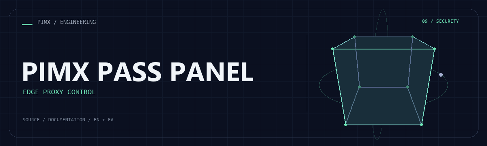

<div align="center">



**[English](README.md) · [فارسی](README.fa.md)**

</div>

# 🛡️ PIMX PASS PANEL

A Cloudflare Worker with a Persian management interface, KV-backed state, subscription generation and WebSocket-to-TCP proxy handling.

[GitHub](https://github.com/MOHAMMADREZAABEDINPOOR/PIMX_PASS_PANEL) · [PIMX / Profile](https://github.com/MOHAMMADREZAABEDINPOOR) · [Static artwork](assets/readme/hero.png)

| At a glance | Details |
|:---|:---|
| 🛡️ Experience | Cloudflare Worker and management interface |
| 🧰 Built with | `Node.js` |
| 🌐 Documentation | [English](README.md) · [فارسی](README.fa.md) |

[✨ Features](#features) · [🚀 Getting started](#getting-started) · [⚙️ Configuration](#configuration) · [🌍 Deployment](#deployment)

---

<a id="features"></a>

## ✨ Features

| Area | Included capability |
|:---|:---|
| ⚡ Workflow | Management interface served directly by the Worker |
| 🔌 Integration | KV-backed configuration and API handlers |
| ⚡ Workflow | Subscription configuration generation |
| 🔌 Integration | WebSocket handling using cloudflare:sockets |

<a id="stack"></a>

## 🧰 Stack

| Tool | Version / source |
|---|---|
| Node.js | `package.json` |

<a id="getting-started"></a>

## 🚀 Getting started

Node.js 22.12+ and the package manager declared in package.json. Install dependencies from the checked-in lockfile where available.

```bash
git clone https://github.com/MOHAMMADREZAABEDINPOOR/PIMX_PASS_PANEL.git
cd PIMX_PASS_PANEL

npm install
npm run dev
```

<a id="configuration"></a>

## ⚙️ Configuration

No standard environment template is defined. Standalone exercises need no external configuration; inspect any service constants or paths in the source before running.

Hosting bindings: `PIMXPASS_KV`.

<a id="usage"></a>

## 🎯 Usage

Create your own `PIMXPASS_KV` namespace, replace the IDs in wrangler.toml and run the local Worker. Review the worker configuration and access controls before deploying.

<a id="project-structure"></a>

## 🗂️ Project structure

| Path | Role |
|---|---|
| [`assets/`](assets/) | Brand/media/README assets |
| [`scripts/`](scripts/) | Development and maintenance utilities |
| [`src/`](src/) | Application source |
| [`package.json`](package.json) | Project entry/configuration file |
| [`wrangler.toml`](wrangler.toml) | Project entry/configuration file |

<a id="commands-and-checks"></a>

## 🧪 Commands and checks

| Command | Purpose |
|:---|:---|
| `npm run dev` | 🧑‍💻 Development server |
| `npm run start` | ▶️ Application server |

```bash
npm run dev
npm run start
```

These commands are declared in package.json; the list is not a test execution report. Test commands may need a browser, service or prepared database.

<a id="deployment"></a>

## 🌍 Deployment

Configure KV bindings with your own resource IDs and store secrets using Wrangler secret. Deploy the Worker and register an HTTPS webhook for a bot. Repository resource IDs are not provisioned for your account.

<a id="limitations"></a>

## 📌 Limitations

This snapshot is a proxy/management prototype. Cloudflare socket restrictions apply. A styled panel does not provision WireGuard or OpenVPN servers; those capabilities should not be inferred from the interface.

<a id="troubleshooting"></a>

## 🛠️ Troubleshooting

- Missing packages: install dependencies using the project’s package manager.
- API/network failure: check the configured origin, provider and hosting bindings.
- Old assets: rebuild when a build script exists, then clear the browser cache.

<a id="contributing"></a>

## 🤝 Contributing

Create a focused branch, verify the affected behavior and explain the change clearly. Keep private data, build outputs and local databases out of commits.

Supporting guides:

- [DEPLOY_GUIDE.md](DEPLOY_GUIDE.md)

<a id="license"></a>

## 📄 License

No repository-level license file is included in this snapshot. Public visibility alone does not grant reuse rights; contact the repository owner for terms.

---

Part of **PIMX** · Documentation in English and Persian.

---

<div align="center">

🛡️ **PIMX PASS PANEL** · [English](README.md) · [فارسی](README.fa.md)

</div>
